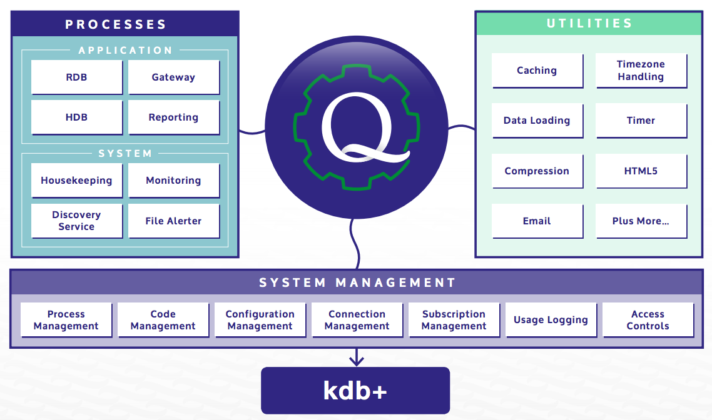

TorQ
====

<iframe src="https://player.vimeo.com/video/184552498" width="640" height="360" frameborder="0" webkitallowfullscreen mozallowfullscreen allowfullscreen></iframe>

The TorQ framework created by [AquaQ Analytics](http://www.aquaq.co.uk) forms the basis of a production kdb+ system by implementing some core functionality and utilities on top of kdb+, allowing developers to concentrate on the application business logic. It incorporates as many best practices as possible, with particular focus on performance, process management, diagnostic information, maintainability and extensibility. Wherever possible, we have tried to avoid re-inventing the wheel and instead have used contributed code from [code.kx.com](http://code.kx.com) (either directly or modified). This framework will be suitable for those looking to create a new kdb+ system from scratch or those looking to add additional functionality to their existing kdb+ systems.

The easiest way to get a production capture started is to download and install one of the [Starter Packs](https://github.com/AquaQAnalytics/TorQ-Finance-Starter-Pack). We also have a [Google Group for questions/discussions](https://groups.google.com/forum/#!forum/kdbtorq).

For recent updates to TorQ please check out our [blog](http://www.aquaq.co.uk/blog/).

We've highlighted some key TorQ features on our blog posts page.

For email support contact <support@aquaq.co.uk>

TorQ Demo Pack
==============

<iframe src="https://player.vimeo.com/video/184552498" width="640" height="360" frameborder="0" webkitallowfullscreen mozallowfullscreen allowfullscreen></iframe>

 

The purpose of the TorQ Demo Pack is to set up an example TorQ
installation and to show how applications can be built and deployed on
top of the TorQ framework. The example installation contains all the key
features of a production data capture installation, including
persistence and resilience. The demo pack includes:

-   a dummy data feed

-   a resilient kdb+ stack to persist data to disk and to allow querying
    across real time data and historic data

-   basic monitoring with notifications via email

-   automated report generation

Once started, TorQ will generate dummy data and push it into an
in-memory real-time database. It will persist this data to disk every
day at midnight. The system will operate 24\*7 and remove old files over
time.

Further information about each feature can be found in the [TorQ
Manual](https://aquaqanalytics.github.io/TorQ/).

*email:* <support@aquaq.co.uk>

*web:* [www.aquaq.co.uk](http://www.aquaq.co.uk)
